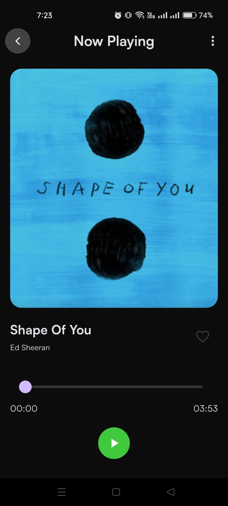

# Spotify Clone

This is a Spotify Clone app made using flutter for frontend and firebase for backend services. Bloc is used for state management and clean architecture is followed for clean code practices. Authentication and user and songs data is being stored on cloud firestore. GetIt is being used as dependency injection.

#

Packages used-

#

1. flutter_svg
2. flutter_bloc
3. just_audio
4. get_it
5. firebase_core
6. cloud_firestore

#

Features-

#

1. Sign in and Register users.
2. Fetch all songs from firebase database.
3. Song Player allowing users to play and pause songs.
4. The option to add and remove favorite songs.
5. A profile screen showing user details and favorite songs.
6. Light and Dark Theme mode.

## Demo

https://drive.google.com/file/d/1qgoqKnIH9TDL26nVVYhfOZ8F3OCaeHR-/view?usp=sharing

## Screen Shots

### Splash Screen

### Intro Screen

### Register Screen

### SignIn Screen

### Choose Mode

### Get Started Screen

### Home Screen

### Song Player Scree

### Profile Screen

